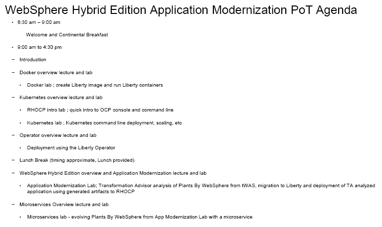

# WebSphere Hybrid Edition - Application Modernization PoT

**Wednesday, June 1, 2023** 

Time: 8:30 pm - 4:30 pm 

This is a 1 day technical workshop.  
  
  - Refer to the **"Hands-on labs"** menu item from the left-navigation section to access the lab guides and lab environment. 
  
  - Refer to the **"Accessing lab environment"** menu item for details on how to access the lab environment. 
  
  
<h3 style="color:black">Proposed Agenda</h3>

<h3 style="color:black">Presentation Material</h3>

[Material shared with attendees](https://ibm.box.com/v/Liberty-Deploy-POT-share)

<h3 style="color:black">Hands-on Labs</h3>

  - [Workshop Labs](./day1.md)  
  
  - [How to access the lab environment](./lab-env.md) 

